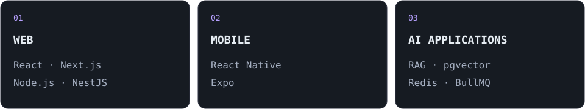

<picture>
  <source media="(prefers-color-scheme: dark)" srcset="assets/banner-dark.svg">
  <source media="(prefers-color-scheme: light)" srcset="assets/banner-light.svg">
  
</picture>

 

## Hey, I'm Antonio 👋

I'm a **full-stack developer based in Valencia, Spain**, building end-to-end JavaScript and TypeScript applications: React interfaces, Node.js microservices and serverless APIs on AWS.

My recent projects explore **AI-powered applications**: document search with RAG, streaming answers with citations, and customer-support workflows that connect AI and human agents.

- **Frontend & mobile:** React, Next.js, React Native and Expo.
- **Backend & APIs:** Node.js, Express and NestJS; REST, GraphQL (Apollo), WebSockets, JWT authentication and role-based access control.
- **Data & caching:** PostgreSQL, DynamoDB, MongoDB, MySQL and Redis.
- **Cloud & architecture:** AWS serverless, microservices and asynchronous workflows; hexagonal architecture in my recent AI projects.
- **AI applications:** RAG, pgvector, streaming responses and BullMQ workers.

## My full-stack toolkit

### Frontend & mobile

React Native · Expo · Redux · Zustand · MobX

### Backend & APIs

REST APIs · GraphQL / Apollo · WebSockets · JWT · Role-based access control · Microservices

### Databases & caching

SQL schema design & query optimization · Redis caching · pgvector for AI retrieval

### AWS & delivery

- **Serverless & messaging:** Lambda, API Gateway, SQS and SNS.
- **Compute & storage:** ECS / Fargate, EC2, S3 and CloudFront.
- **Identity & monitoring:** Cognito and CloudWatch.
- **Delivery:** Docker, Terraform and GitHub Actions CI/CD.

### Testing & quality

Jest · Supertest for API testing · React Testing Library · Cypress · Storybook · WCAG 2.1 accessibility

 

<picture>
  <source media="(prefers-color-scheme: dark)" srcset="assets/focus-dark.svg">
  <source media="(prefers-color-scheme: light)" srcset="assets/focus-light.svg">
  
</picture>

## Selected projects

### [AI Customer Support](https://github.com/AntonioVillegas01/ai-customer-support)

A multi-tenant customer-support project combining knowledge retrieval, AI responses and handoff to human agents.

`TypeScript` · `Next.js` · `NestJS` · `PostgreSQL / pgvector` · `Redis / BullMQ`

### [AI Knowledge Base · RAG](https://github.com/AntonioVillegas01/ai-knowledge-base-RAG-application)

Upload documents, process them asynchronously and ask questions with streaming answers and citations. Organized around hexagonal architecture.

`Next.js` · `NestJS` · `pgvector` · `BullMQ` · `OpenRouter`

### [Antonio Developer · Portfolio](https://github.com/AntonioVillegas01/antoniodeveloper-react)

My personal developer landing page built with React.

`React` · `JavaScript`

---

  <a href="https://antoniodeveloper.com">antoniodeveloper.com</a>
   
  Web · Mobile · AI

